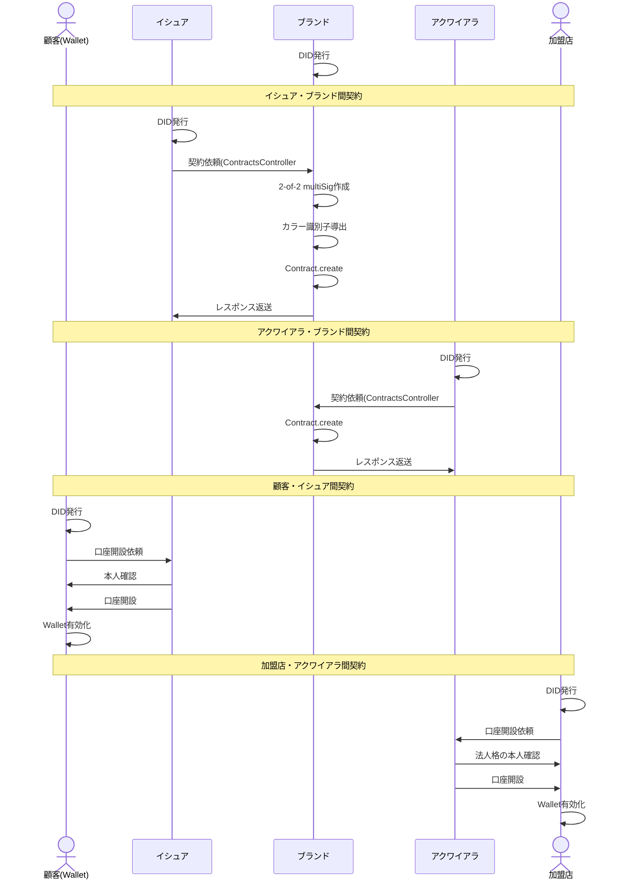
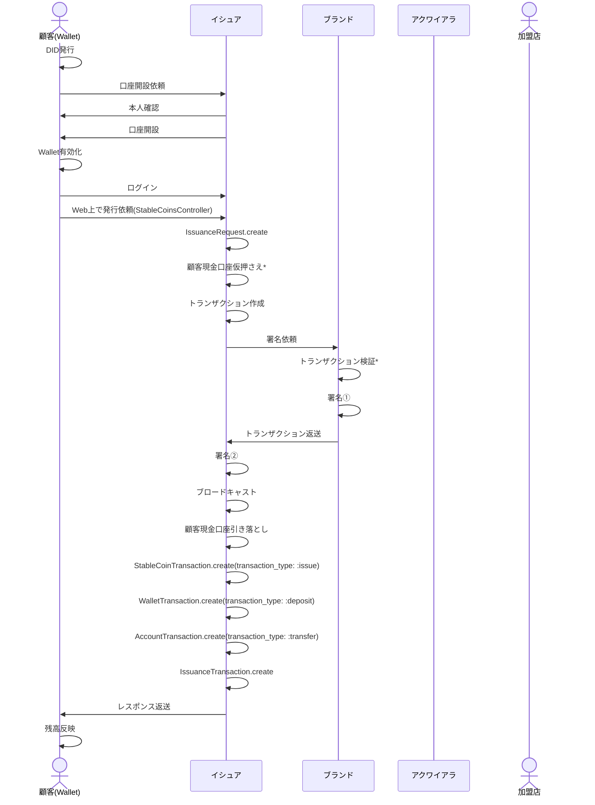
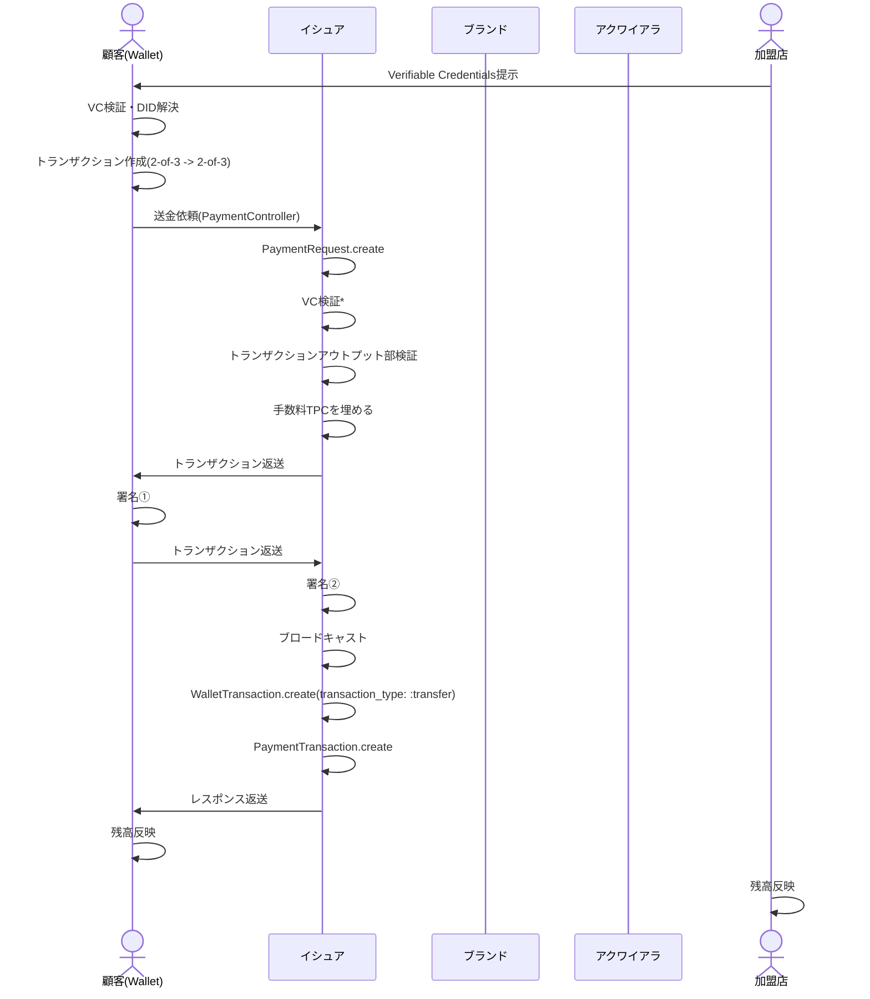
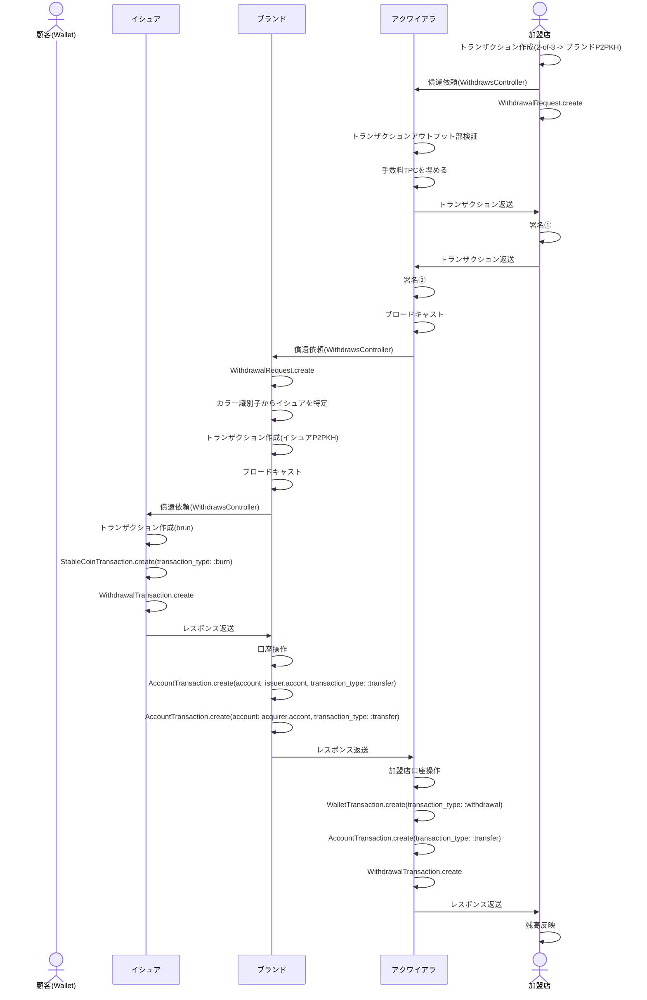

# FCS Document - Sequence Diagram

## 各種契約

```mermaid
sequenceDiagram
	actor u as 顧客(Wallet)
	participant i as イシュア
	participant b as ブランド
	participant a as アクワイアラ
	actor m as 加盟店

	b ->> b: DID発行

	Note over u, m: イシュア・ブランド間契約
	i ->> i: DID発行
	i ->> b: 契約依頼(ContractsController#agreement_with_issuer)
	b ->> b: 2-of-2 multiSig作成
	b ->> b: カラー識別子導出
	b ->> b: Contract.create
	b ->> i: レスポンス返送

	Note over u, m: アクワイアラ・ブランド間契約
	a ->> a: DID発行
	a ->> b: 契約依頼(ContractsController#agreement_with_acquirer)
	b ->> b: Contract.create
	b ->> a: レスポンス返送

	Note over u, m: 顧客・イシュア間契約
	u ->> u: DID発行
	u ->> i: 口座開設依頼
	i ->> u: 本人確認
	i ->> u: 口座開設
	u ->> u: Wallet有効化

	Note over u, m: 加盟店・アクワイアラ間契約
	m ->> m: DID発行
	m ->> a: 口座開設依頼
	a ->> m: 法人格の本人確認
	a ->> m: 口座開設
	m ->> m: Wallet有効化
```

## 発行

```mermaid
sequenceDiagram
	actor u as 顧客(Wallet)
	participant i as イシュア
	participant b as ブランド
	participant a as アクワイアラ
	actor m as 加盟店

	u ->> u: DID発行
	u ->> i: 口座開設依頼
	i ->> u: 本人確認
	i ->> u: 口座開設
	u ->> u: Wallet有効化
	u ->> i: ログイン
	u ->> i: Web上で発行依頼(StableCoinsController)
	i ->> i: IssuanceRequest.create
	i ->> i: 顧客現金口座仮押さえ*
	i ->> i: トランザクション作成
	i ->> b: 署名依頼
	b ->> b: トランザクション検証*
	b ->> b: 署名①
	b ->> i: トランザクション返送
	i ->> i: 署名②
	i ->> i: ブロードキャスト
	i ->> i: 顧客現金口座引き落とし
	i ->> i: StableCoinTransaction.create(transaction_type: :issue)
	i ->> i: WalletTransaction.create(transaction_type: :deposit)
	i ->> i: AccountTransaction.create(transaction_type: :transfer)
	i ->> i: IssuanceTransaction.create
	i ->> u: レスポンス返送
	u ->> u: 残高反映
```

## 送金

```mermaid
sequenceDiagram
	actor u as 顧客(Wallet)
	participant i as イシュア
	participant b as ブランド
	participant a as アクワイアラ
	actor m as 加盟店

	m ->> u: Verifiable Credentials提示
	u ->> u: VC検証・DID解決
	u ->> u: トランザクション作成(2-of-3 -> 2-of-3)
	u ->> i: 送金依頼(PaymentController)
	i ->> i: PaymentRequest.create
	i ->> i: VC検証*
	i ->> i: トランザクションアウトプット部検証
	i ->> i: 手数料TPCを埋める
	i ->> u: トランザクション返送
	u ->> u: 署名①
	u ->> i: トランザクション返送
	i ->> i: 署名②
	i ->> i: ブロードキャスト
	i ->> i: WalletTransaction.create(transaction_type: :transfer)
	i ->> i: PaymentTransaction.create
	i ->> u: レスポンス返送
	u ->> u: 残高反映
	m ->> m: 残高反映
```

## 償還

```mermaid
sequenceDiagram
	actor u as 顧客(Wallet)
	participant i as イシュア
	participant b as ブランド
	participant a as アクワイアラ
	actor m as 加盟店

	m ->> m: トランザクション作成(2-of-3 -> ブランドP2PKH)
	m ->> a: 償還依頼(WithdrawsController)
	m ->> m: WithdrawalRequest.create
	a ->> a: トランザクションアウトプット部検証
	a ->> a: 手数料TPCを埋める
	a ->> m: トランザクション返送
	m ->> m: 署名①
	m ->> a: トランザクション返送
	a ->> a: 署名②
	a ->> a: ブロードキャスト
	a ->> b: 償還依頼(WithdrawsController)
	b ->> b: WithdrawalRequest.create
	b ->> b: カラー識別子からイシュアを特定
	b ->> b: トランザクション作成(イシュアP2PKH)
	b ->> b: ブロードキャスト
	b ->> i: 償還依頼(WithdrawsController)
	i ->> i: トランザクション作成(brun)
	i ->> i: StableCoinTransaction.create(transaction_type: :burn)
	i ->> i: WithdrawalTransaction.create
	i ->> b: レスポンス返送
	b ->> b: 口座操作
	b ->> b: AccountTransaction.create(account: issuer.accont, transaction_type: :transfer)
	b ->> b: AccountTransaction.create(account: acquirer.accont, transaction_type: :transfer)
	b ->> a: レスポンス返送
	a ->> a: 加盟店口座操作
	a ->> a: WalletTransaction.create(transaction_type: :withdrawal)
	a ->> a: AccountTransaction.create(transaction_type: :transfer)
	a ->> a: WithdrawalTransaction.create
	a ->> m: レスポンス返送
	m ->> m: 残高反映

```
